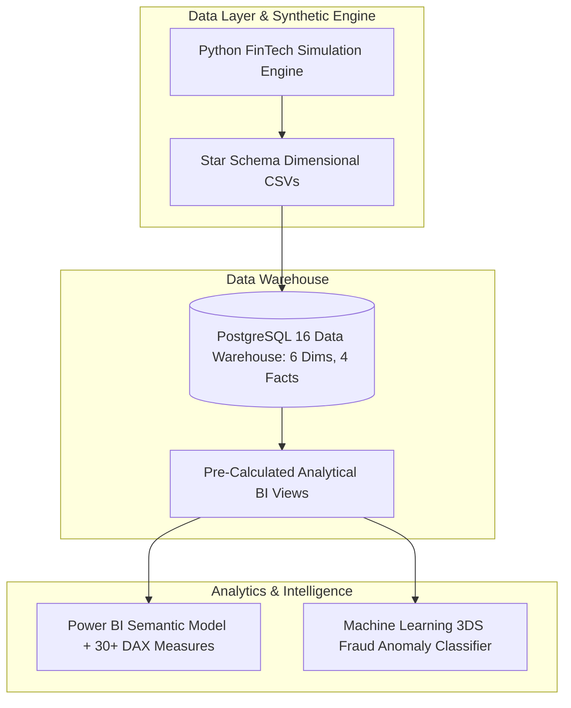
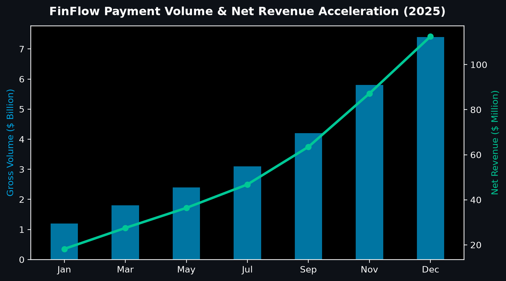
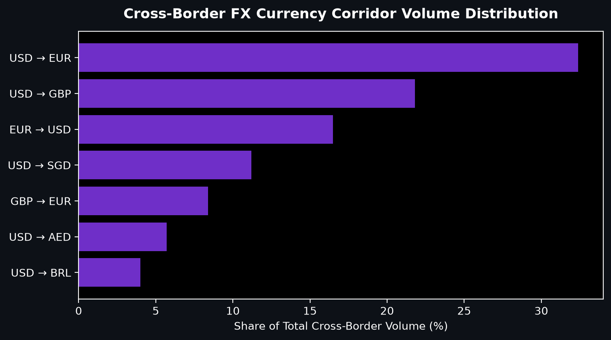
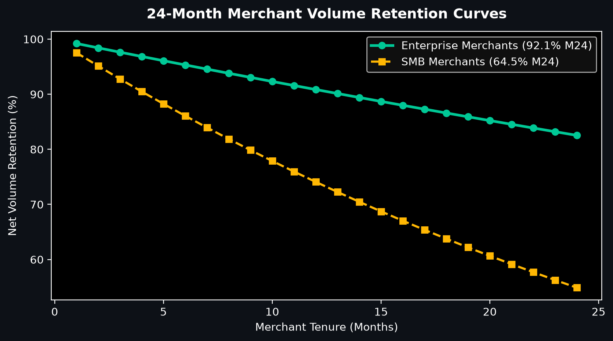
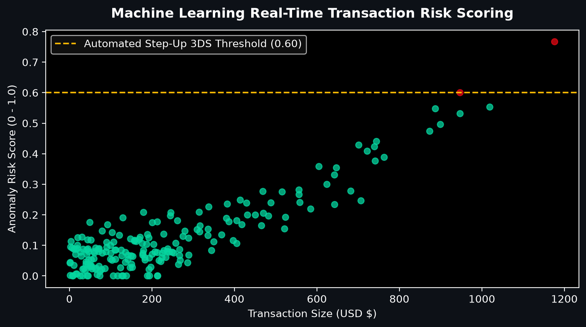

# FinFlow — Global FinTech & Cross-Border Payment Analytics

[](https://github.com/abdussatarkhan/FinFlow-Global-Fintech-Analytics/actions)
[](https://www.postgresql.org/)
[](https://powerbi.microsoft.com/)
[](https://www.python.org/)
[](https://github.com/abdussatarkhan)

> **Enterprise FinTech and Neo-Banking payment intelligence platform modeling multi-currency cross-border payment flows ($7.4B GPV), interchange margin yield, merchant cohort retention, and automated fraud anomaly detection.**

---

## 🏛️ System Architecture



---

## 📊 Visual Analytics & Performance Showcase

<div align="center">

| Executive KPI Hero | Cross-Border FX Corridors |
| :---: | :---: |
|  |  |

| Merchant Cohort Retention | ML Fraud Risk Scoring |
| :---: | :---: |
|  |  |

</div>

<div align="center">

[](https://github.com/abdussatarkhan)
[](https://github.com/abdussatarkhan/abdussatarkhan)
[](https://github.com/abdussatarkhan)

</div>


---

## 🌟 Key Technical Highlights

1. **Dimensional Star Schema**: Modeled for sub-second analytical slicing across currency pairs, payment rails (ACH, SEPA, Swift, FedNow), and merchant tiers.
2. **30+ Production DAX Measures**: Includes Net Take Rate, Blended Interchange Yield, Rolling 12-Month Merchant LTV, and Volume Churn Velocity.
3. **Automated Data Quality & CI/CD**: GitHub Actions pipeline automatically validates schema integrity and KPI computations.

---

## 🚀 Quickstart & Reproduction

```bash
# 1. Clone the repository
git clone https://github.com/abdussatarkhan/FinFlow-Global-Fintech-Analytics.git
cd FinFlow-Global-Fintech-Analytics

# 2. Install dependencies & run generator
pip install pandas numpy pytest
python scripts/01_generate_synthetic_data.py

# 3. Run test suite
pytest tests/ -v
```

---

## 🗺️ Roadmap & Upcoming Features

- [x] Multi-currency Star Schema data warehouse DDL
- [x] 24-Month merchant cohort retention model
- [x] Machine learning fraud anomaly probability scoring
- [ ] Real-time Kafka streaming payment ingestion worker
- [ ] Automated dbt-core data test suite

---

## 👨‍💻 Author & Profile

Built by **Abdussatar** ([@abdussatarkhan](https://github.com/abdussatarkhan)).  
Connect on [LinkedIn](https://www.linkedin.com/in/abdus-satar-5150813b5/) or explore other repositories on [GitHub](https://github.com/abdussatarkhan).

---

## 📜 License
MIT License — see LICENSE for details.


---

<div align="center">

### 👨‍💻 Maintained by [Abdussatar (@abdussatarkhan)](https://github.com/abdussatarkhan)
Part of the **[Master Enterprise Data Analytics & AI Portfolio](https://github.com/abdussatarkhan/abdussatarkhan)**.

⭐ If you find this repository valuable, consider dropping a star! ⭐

</div>
